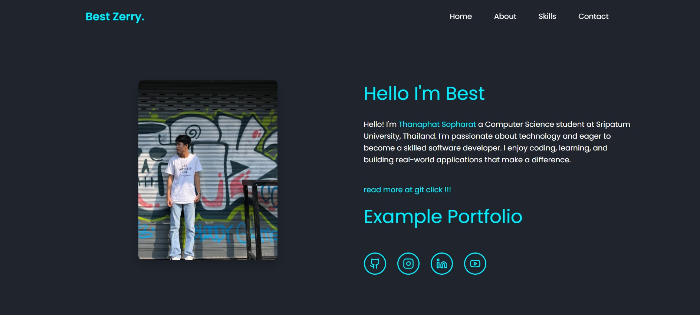

# 🎓 Exam Portfolio - By 2bitdevv

Welcome to my **Personal Exam Portfolio Website**, built with [Vite](https://vitejs.dev/) + [React](https://reactjs.dev/) + [TypeScript](https://www.typescriptlang.org/) 🎨

🔗 **Live Website:**  
👉 https://2bitdevv.github.io/examportfolio/

---

## 📂 Project Structure

- **`src/`** – Main application code
- **`public/`** – Static assets (images, etc.)
- **`vite.config.ts`** – Vite config with GitHub Pages base path
- **`README.md`** – You’re reading it :)

---

## 🚀 Tech Stack

- ⚡️ Vite
- ⚛️ React
- 🟦 TypeScript
- 🎨 CSS (custom/styled as needed)
- 🛠 GitHub Pages for deployment

---

## 📸 Preview

 <!-- ใส่รูปจากโปรเจกต์ หรือใช้ URL -->

---
